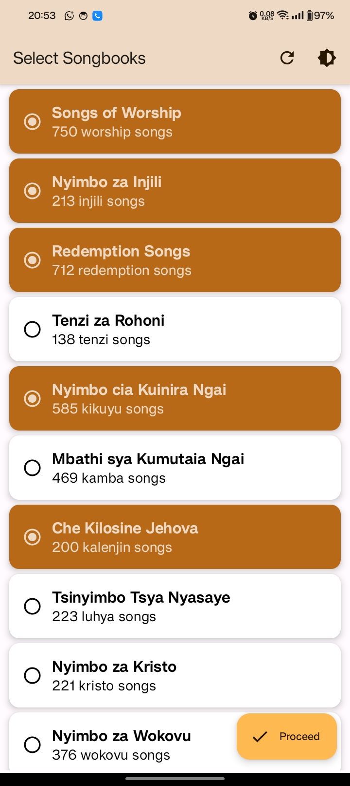
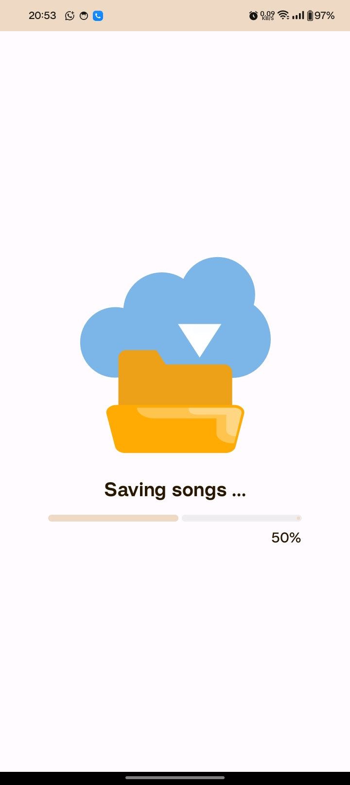

# 🎵 SongLib

**SongLib** is a modern, cross-platform church hymn library and songbook manager.
With **10+ songbooks**, **10000+ songs** and powerful search, it lets you keep all your favorite hymns right at your fingertips — even offline.

> 🔗 iOS Version Repo: [@SiroDaves/SongLib-iOS](https://github.com/SiroDaves/SongLib-iOS)

## ✨ Features

* 📖 **14 Songbooks Included** – Choose from a wide selection of hymnals.
* 📚 **Custom Collections** – Create your own set of favorite church hymns.
* 🔍 **Real-Time Search** – Search by song **title**, **number**, or **lyrics** instantly.
* 📜 **Verse Navigation** – Swipe up/down to slide through song verses seamlessly.
* 🌐 **Cross-Platform** – Runs on **Android**, **iOS**, **Windows**, **Linux**, and **macOS**.
* 📶 **Offline Mode** – Once set up, the app works without internet access.
* ☁ **Cloud-Backed** – Uses a **MongoDB** database with backend services for sync and updates.

Backend API: [`https://songlive.vercel.app/api`](https://songlive.vercel.app/api)

## 📸 Screenshots

<table>
    <tr>
        <td></td>
        <td></td>
        <td></td>
    </tr>
</table>

## 🛠 Tech Stack

### **Frontend**

* **Jetpack Compose** (Android UI)
* **Material Design 3** + Material Icons
* **Room Database** for local storage
* **Navigation Component** for in-app navigation
* **Hilt** for dependency injection
* **Retrofit + OkHttp** for networking

### **Backend**

* **Node.js** + **MongoDB**
* REST API hosted on **Vercel**

## 🚀 Getting Started (Android)

1. **Clone the repo**

   ```bash
   git clone https://github.com/SiroDaves/SongLib-Android.git
   cd SongLib-Android
   ```

2. **Open in Android Studio**
   Make sure you have **Android Studio Flamingo+** with Kotlin and Compose support.

3. **Run the app**
   Select a device/emulator and hit **Run ▶**.

4. **Backend Setup (Optional)**
   If you want to connect to your own backend, update the API endpoint in the config to point to your MongoDB-powered service.

## 📄 License

MIT License — Feel free to use, modify, and distribute.
