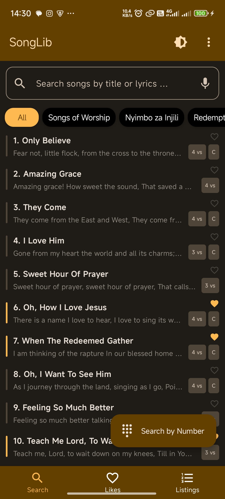
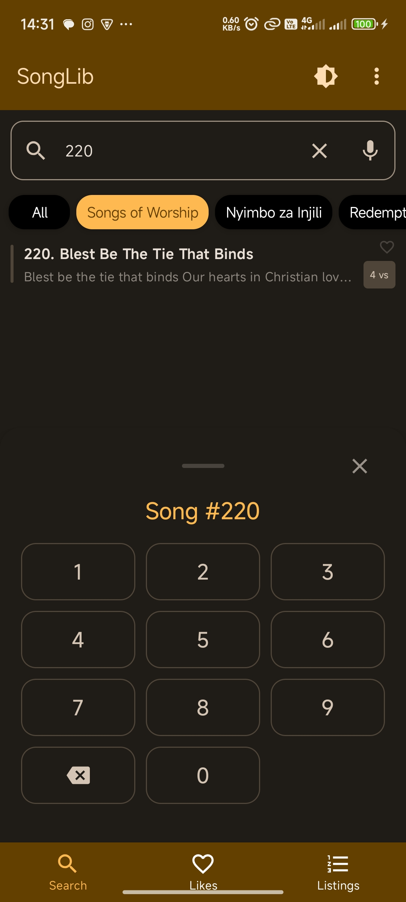
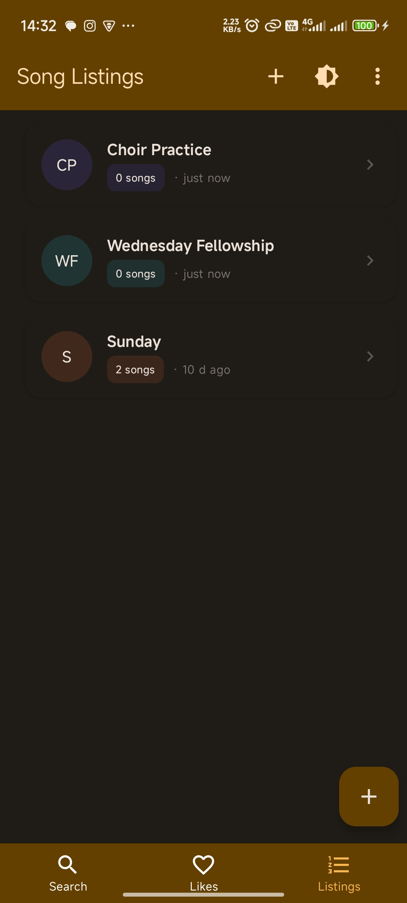
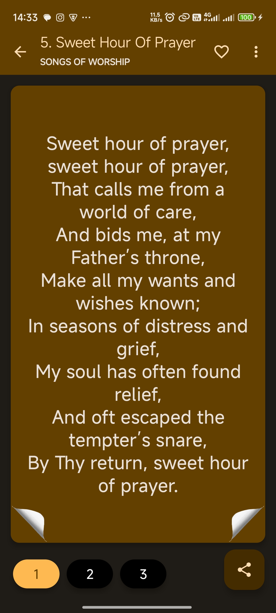

# SongLib — Android

SongLib is an open-source church songbook app for Android. It gives congregations offline access to multiple songbooks, a full-screen verse presenter, personal drafts, song listings, search history, and user song editing with admin review.

> iOS version: [@SiroDaves/SongLib-iOS](https://github.com/SiroDaves/SongLib-iOS)

> Live api: [https://songlive.vercel.app/api/v2](https://songlive.vercel.app/api/v2)

This guide covers everything you need to get the Android app built and running.

---

## Features

- **20+ songbooks included** — choose from a wide selection of hymnals across multiple languages
- **10,000+ songs** — full lyrics, song numbers, and aliases all searchable
- **Real-time search** — search by title, number, or lyrics instantly
- **Verse presenter** — full-screen swipeable verse view with adjustable font size and a page-curl effect
- **Offline mode** — once synced, the app works entirely without internet access
- **Personal drafts** — write and present your own song drafts
- **Song listings** — create custom playlists / sets for a service
- **Search and view history** — jump back to recently viewed songs and past searches
- **Song editing** — logged-in users can submit corrections; admins review and approve them
- **Google Sign-In** — optional account for syncing drafts and edits across devices
- **Donation support** — PesaPal payment flow for supporting the project
- **Cloud-backed** — MongoDB database with a Node.js/TypeScript API on Vercel

---

## Screenshots

<table>
  <tr>
    <td></td>
    <td></td>
    <td></td>
    <td></td>
  </tr>
</table>

---

## Table of contents

- [Tech stack](#tech-stack)
- [Prerequisites](#prerequisites)
- [Project structure](#project-structure)
- [Architecture overview](#architecture-overview)
  - [Module graph](#module-graph)
  - [Core modules](#core-modules)
  - [Feature modules](#feature-modules)
  - [Navigation](#navigation)
  - [Sync and data flow](#sync-and-data-flow)
- [Getting started](#getting-started)
  - [1. Clone the repository](#1-clone-the-repository)
  - [2. Create local.properties](#2-create-localproperties)
  - [3. Add google-services.json](#3-add-google-servicesjson)
  - [4. Run the app](#4-run-the-app)
  - [5. Release builds (optional)](#5-release-builds-optional)
- [Contributing](#contributing)

---

## Tech stack

| Concern | Library / tool |
|---|---|
| UI | Jetpack Compose, Material 3 |
| Architecture | MVVM, multi-module Gradle |
| Dependency injection | Hilt |
| Local database | Room (schema version 4) |
| Networking | Retrofit 2 + OkHttp |
| Background sync | WorkManager |
| Authentication | Google Sign-In via Credential Manager API |
| Error monitoring | Sentry |
| Payments | PesaPal (donation flow) |
| Min SDK | 26 (Android 8.0) |
| Target / Compile SDK | 37 |

---

## Prerequisites

Before you start, make sure you have the following:

- **Android Studio** Hedgehog (2023.1.1) or newer
- **JDK 17** — required by the `build-logic` convention plugins
- **Android SDK** with API 26–37 installed (the SDK Manager inside Android Studio handles this)
- **A SongLib API key** — contact the maintainer to get one. The key authenticates write operations against the live API.
- **A Google Cloud project** with an OAuth 2.0 web client ID configured for Google Sign-In, and the corresponding Firebase project with `google-services.json` downloaded

The Sentry and PesaPal keys are optional for most contributors — the app builds and runs without them.

---

## Project structure

```
SongLib/
├── app/                        # Application shell — entry point, navigation, top-level DI
│   └── src/main/java/com/songlib/
│       ├── MainActivity.kt
│       ├── MainViewModel.kt
│       ├── SongLibApp.kt
│       └── app/navigation/AppNavHost.kt
│
├── build-logic/                # Shared Gradle convention plugins (Hilt, Compose, library)
│
├── core/
│   ├── common/                 # Routes, ApiConstants, SongUtils, UiState — no Android deps
│   ├── data/                   # Repositories, PrefsRepo, SyncWorker, SyncScheduler
│   ├── database/               # Room database, all DAOs and entity models
│   ├── designsystem/           # Material 3 theme, colours, typography
│   ├── network/                # Retrofit services, DTOs, NetworkModule
│   └── ui/                     # Shared Compose components (SongItem, TopBar, shimmer…)
│
└── feature/
    ├── selection/              # First-launch songbook selection
    ├── home/                   # Search, Likes, Listings tabs
    ├── song/                   # Song presenter + editor
    ├── drafts/                 # Drafts list, draft presenter, draft editor
    ├── history/                # Search and view history
    ├── listing/                # Listed songs screen
    ├── edits/                  # User edits + admin review screen
    ├── settings/               # Settings + user profile
    ├── donation/               # PesaPal donation WebView
    ├── help/                   # Help screen
    └── howitworks/             # How it works screen
```

---

## Architecture overview

### Module graph

Feature modules depend only on `core` modules and never on each other. All cross-feature navigation lives in `app`.

```
app
 ├── core:common
 ├── core:data       → core:database, core:network, core:common
 ├── core:designsystem
 ├── core:ui         → core:common, core:database, core:designsystem
 └── feature:*       → core:common, core:data, core:database, core:designsystem, core:ui
```

### Core modules

**`core:common`** — pure Kotlin. Holds `Routes` (all navigation route strings), `ApiConstants`, `PrefConstants`, `AppFonts`, `SongUtils` (in-memory search against title, alias, and content), `UiState` (sealed class: `Loading`, `Loaded`, `Filtered`, `Saving`, `Error`), and `NetworkUtils`.

**`core:data`** — all data-access logic sitting above the DB and network layers:

- `PrefsRepo` — a strongly typed `SharedPreferences` wrapper covering the user session, theme, sync timestamps, demo mode, donation state, book selection, and `resetAppData()` for clearing all app state atomically.
- `SongBookRepo` — fetches books and songs from the remote API, persists them to Room, and handles paginated delta sync via the `?since=` query parameter so subsequent syncs only transfer new or updated songs.
- `TrackingRepo` — records song view history and search query history to Room.
- `EditorRepo` — manages user-submitted song edits locally and syncs them to the backend.
- `DraftRepo` — manages personal drafts locally and pushes them to the backend when a user is signed in.
- `ListingRepo` — manages song listing (playlist) creation and item membership.
- `UserRepo` — user creation, profile updates, and book-selection sync.
- `SyncWorker` — a Hilt-injected `CoroutineWorker` that runs the full sync pipeline on a background thread. Scheduled via `SyncScheduler` using WorkManager.

**`core:database`** — Room database (`AppDatabase`, version 4) with seven entities: `BookEntity`, `SongEntity`, `HistoryEntity`, `SearchEntity`, `DraftEntity`, `EditEntity`, `ListingEntity`, and their DAOs.

**`core:network`** — `NetworkModule` (Hilt) wires up two Retrofit instances: one for the SongLib API (with an `x-api-key` OkHttp interceptor that attaches the key to every request) and one for PesaPal. `SongLibService` is the Retrofit interface covering all v2 endpoints.

**`core:designsystem`** — Material 3 theme, colour palette, typography scale, and `ThemeSelectorDialog`.

**`core:ui`** — shared Compose components: `AppTopBar`, `SearchTopBar`, `SongItem`, `SongSkeletonItem`, `BookItem`, `ListingItem`, `DonationBanner`, `EmptyState`, `ErrorState`, `LoadingState`, `PageCurlEffect`, `CornerNavZone`, and auto-sizing text utilities.

### Feature modules

| Module | Screens | ViewModels |
|---|---|---|
| `feature:selection` | Songbook selection (step 1 and 2) | `SelectionViewModel` |
| `feature:home` | Home — Search / Likes / Listings tabs | `HomeViewModel` |
| `feature:song` | Song presenter, song editor | `PresenterViewModel`, `EditorViewModel` |
| `feature:drafts` | Drafts list, draft presenter, draft editor | `DraftsViewModel`, `DraftPresenterViewModel`, `EditorViewModel` |
| `feature:history` | Search history, view history | `HistoryViewModel` |
| `feature:listing` | Listed songs | `ListingViewModel` |
| `feature:edits` | My edits (user), pending edits review (admin) | `EditsViewModel`, `AdminEditsViewModel` |
| `feature:settings` | Settings, user profile | `SettingsViewModel`, `UserProfileViewModel` |
| `feature:donation` | PesaPal donation WebView | `DonationViewModel` |
| `feature:help` | Help | — |
| `feature:howitworks` | How it works | — |

All ViewModels are `@HiltViewModel`-annotated and follow the same pattern: `StateFlow` for all UI state (observed with `collectAsState()` in the composable), `SharedFlow` for fire-and-forget events like toasts, and `viewModelScope` with `Dispatchers.IO` for database and network work switching back to `Dispatchers.Main` for state emission.

### Navigation

Navigation is handled by a single `NavHostController` in `AppNavHost.kt` at the `app` level. Route strings are constants in `Routes` (`core:common`).

Arguments between screens are passed via `savedStateHandle` — the **caller** sets the value on `navController.currentBackStackEntry?.savedStateHandle` before calling `navigate()`, and the **destination** reads it from its own `currentBackStackEntry?.savedStateHandle`.

`MainViewModel` determines the start destination at launch by reading `PrefsRepo`: if the user hasn't completed book selection it routes to `SELECTION`, otherwise to `HOME`.

```
SELECTION ──► HOME ──► PRESENT
                  ├──► DRAFT_PRESENT ──► DRAFT_EDITOR
                  ├──► LISTING
                  ├──► HISTORY
                  ├──► SETTINGS ──► USER_PROFILE
                  ├──► DONATION
                  ├──► DRAFTS
                  ├──► USER_EDITS
                  ├──► ADMIN_EDITS
                  ├──► EDITOR
                  ├──► HOW_IT_WORKS
                  └──► HELP
```

### Sync and data flow

On the very first launch (or after re-selecting books), `MainViewModel` calls `SyncScheduler.scheduleInstallSync()`, which enqueues a one-time `SyncWorker` via WorkManager. The worker:

1. Reads selected book IDs from `PrefsRepo.selectedBooks`.
2. Fetches all books from `/api/v2/books` and saves them to Room.
3. Fetches songs page by page (`limit=500`) from `/api/v2/songs/books/{bookIds}`. On subsequent syncs the `?since=` parameter carries the ISO timestamp of the last successful run, so only new or updated songs are transferred — this is the delta sync mechanism.
4. Writes the new `since` timestamp back to `PrefsRepo.lastSinceDateIso` and marks `isDataLoaded = true`.
5. If a user is signed in, pushes local drafts, edits, and book-selection data to the backend.

`HomeViewModel.fetchData()` is guarded by a `dataFetched` boolean so it only runs once per ViewModel lifetime. It reads from Room immediately to show cached data, while observing `WorkInfo` state via `getWorkInfosByTagFlow` — when the worker reports `SUCCEEDED` it calls `loadFromDb()` again to pick up the freshly synced songs.

Daily re-sync fires on subsequent opens when `PrefsRepo.needsDailySync()` returns true (more than 24 hours since `lastSyncedAt`).

---

## Getting started

### 1. Clone the repository

```bash
git clone git@github.com:SiroDevs/SongLib.git
cd SongLib
```

### 2. Create `local.properties`

This file is gitignored. Create it at the project root (alongside `build-logic/`, `app/`, `core/`, `feature/`).

```properties
# Path to your Android SDK — Android Studio usually writes this automatically.
# If you open the project in Android Studio first, this line will already be here.
sdk.dir=/Users/yourname/Library/Android/sdk

# Required — API key for the SongLib backend (contact the maintainer)
SONGLIB_API_KEY=your_api_key_here

# Required — Google OAuth 2.0 web client ID for Sign-In
# Get this from console.cloud.google.com → APIs & Services → Credentials
GOOGLE_WEB_CLIENT_ID=your_google_web_client_id_here

# Optional — only needed if working on the donation feature
PESAPAL_CONSUMER_KEY=
PESAPAL_CONSUMER_SECRET=
PESAPAL_IPN_ID=

# Optional — only needed if working on Sentry error reporting
SENTRY_AUTH_TOKEN=
```

All five `buildConfigField` entries in `app/build.gradle.kts` read from these keys. If a key is missing the build will still succeed but the corresponding feature (sign-in, donations, error reporting) will not work at runtime.

### 3. Add `google-services.json`

Place your Firebase project's `google-services.json` inside the `app/` directory:

```
app/
├── google-services.json    ← here
├── build.gradle.kts
└── src/
```

This file is required for Google Sign-In via the Credential Manager API. To get it:

1. Go to [console.firebase.google.com](https://console.firebase.google.com) and open (or create) the Firebase project linked to your Google Cloud OAuth client.
2. Add an Android app with package name `com.songlib` (debug builds use `com.songlib.dev`).
3. Download `google-services.json` and place it in `app/`.

If you are only working on features unrelated to sign-in and want to skip Firebase entirely, add a placeholder `google-services.json` — the build requires the file to exist even if sign-in is not exercised.

### 4. Run the app

Open the project in Android Studio. Gradle sync will run automatically. Once it completes, select the `debug` build variant and run the `app` configuration on a device or emulator running API 26 or higher.

```bash
# Or from the command line:
./gradlew :app:installDebug
```

The `debug` build variant uses the application ID `com.songlib.dev`, so it installs alongside the production Play Store build without conflict.

On first launch the app will go through the songbook selection flow, then trigger a background sync via WorkManager to fetch books and songs from the live API. You need a network connection for this initial sync — after that the app works fully offline.

### 5. Release builds (optional)

Release signing is configured in `app/build.gradle.kts` and reads from a `keystore/key.properties` file. This is only needed if you are cutting a release build — **not required for development or contributing**.

Create `keystore/key.properties` at the project root:

```properties
storeFile=../keystore/release.jks
storePassword=your_store_password
keyAlias=your_key_alias
keyPassword=your_key_password
```

Then build:

```bash
./gradlew :app:bundleRelease    # AAB for Play Store
./gradlew :app:assembleRelease  # APK for direct install
```

---

## Contributing

1. Fork the repository and create a feature branch off `develop`.
2. New screens belong in a `feature` module. If you are adding a genuinely new section of the app, create a new feature module following the same `build.gradle.kts` structure as the existing ones.
3. Shared UI components go in `core:ui`. Logic that multiple features need goes in a repository in `core:data`.
4. All ViewModels must be `@HiltViewModel`-annotated. All repositories must be `@Singleton`-scoped.
5. Open a pull request with a clear description and reference any related issue.

For questions, open a GitHub issue.

**API docs:** [songlive.vercel.app/api/v2/docs](https://songlive.vercel.app/api/v2/docs)

**License:** MIT — feel free to use, modify, and distribute.